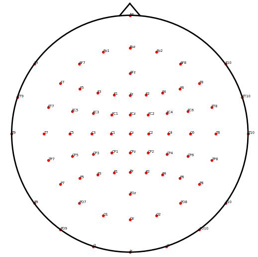
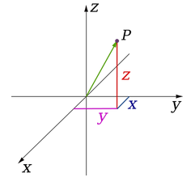

[](https://zenodo.org/badge/latestdoi/136149692) [](https://github.com/sappelhoff/eeg_positions/actions?query=workflow%3A%22Python+build+and+tests%22) [](https://codecov.io/gh/sappelhoff/eeg_positions)

# eeg_positions

When recording electroencephalography (EEG) data, electrodes are usually placed
according to an international standard. The `10-20`, and by extension the
`10-10` and `10-05` systems are established sets of rules for this case
[[1]](https://www.biosemi.com/publications/pdf/Oostenveld2001b.pdf). Even when
the actual electrode locations have not been empirically measured during the
recording, an approximation  of these positions is important for for plotting
topographies or visualizing locations of sensors with the help of analysis
software.

While standard locations are available in many places such as from Robert
Oostenveld's [blog](http://robertoostenveld.nl/electrode/) or directly from
electrode cap manufacturers such as [Easycap](https://www.easycap.de/), it is
seldom specified how these electrode locations are calculated.

**This repository contains code to compute the standard EEG electrode locations
in 3D for the `10-20`, `10-10`, or even `10-05` system.** There are also utility
functions to project the 3D locations to 2D space and plot them.

## Cite

If you find this repository useful and want to cite it in your work, please go
to the [Zenodo record](https://doi.org/10.5281/zenodo.3718568) and obtain the
appropriate citation from the *"Cite as"* section there.

## At a glance

- The electrode locations are computed on a geometrical sphere centered on the
  origin and with radius 1 (arbitrary units).
- The function uses an algorithm to compute positions at fractions along
  contour lines defined by three points: See the `find_point_at_fraction`
  function in the `eeg_positions/utils.py` file.

## How to work with it

- `git clone` the repository (or download as `.zip` and unpack)
- `cd eeg_positions`
- Using your python environment of choice, install the package and its
  dependencies locally using `pip install -e .`
- Run the tests using `pytest --doctest-modules` (you might have to `pip install pytest` first)
- Calculate and plot electrodes by calling `python eeg_positions/eeg_positions.py`
- Check out `config.py` for the order how electrodes are computed
- ... and see `utils.py` for the `find_point_at_fraction` function that is the
  core of the computations.

## References

- [1] Oostenveld, R., & Praamstra, P. (2001). The five percent electrode system
  for high-resolution EEG and ERP measurements. Clinical neurophysiology,
  112(4), 713-719. doi:
  [10.1016/S1388-2457(00)00527-7](https://www.biosemi.com/publications/pdf/Oostenveld2001b.pdf)

## Acknowledgements

My thanks to:

- Robert Oostenveld for writing his [blog post](http://robertoostenveld.nl/electrode/)
  on electrodes
- Ed Williams for the helpful correspondence and discussions about
  "intermediate points on a great circle" (see his
  [aviation formulary](http://www.edwilliams.org/avform.htm#Intermediate))
- "N. Bach" and "Nominal Animal" who helped me to figure out the math for
  the `find_point_at_fraction` function (see this
  [math.stackexchange.com post](https://math.stackexchange.com/questions/2800845/find-intermediate-points-on-small-circle-of-a-sphere/2805204#2805204))

---

# Examples

## Read the data into [MNE-Python](https://mne.tools)

- NOTE: Please download the 3D `10-05` data from [here](./data/standard_1005.tsv)
  and save as `standard_1005.tsv`.
- `mne` version >= 0.22 is required.

```Python
import mne
import numpy as np
import pandas as pd


# we saved this file before ...
fname = 'standard_1005.tsv'

# Now read it
df = pd.read_csv(fname, sep="\t")

# Turn data into montage
ch_pos = df.set_index("label").to_dict("index")
for key, val in ch_pos.items():
    ch_pos[key] = np.asarray(list(val.values()))

data = mne.utils.Bunch(
    nasion=ch_pos["Nz"],
    lpa=ch_pos["T9"],
    rpa=ch_pos["T10"],
    ch_pos=ch_pos,
    coord_frame="unknown",
    hsp=None,
    hpi=None,
)

montage = mne.channels.make_dig_montage(**data)

# plot it, using kind="topomap" for 2D, or kind="3d" for 3D
montage.plot(kind="topomap", sphere=(0, 0, 0, 1))

```

## Interactively viewing 3D coordinates

reproduce by running `python eeg_positions/eeg_positions.py`


## Projections to 2D

reproduce by running `python eeg_positions/eeg_positions.py`

### 10-20 system


### 10-10 system


### 10-05 system


---

# Details

## Coordinate System Conventions

### 3D Axes and Cartesian Coordinate System

- Imagine the x-axis pointing roughly towards the viewer with increasing values
- The y-axis is orthogonal to the x-axis, pointing to the right of the viewer
  with increasing values
- The z-axis is orthogonal to the xy-plane and pointing vertically up with
  increasing values



### Relationship of Coordinate System to a Human Head

For simplicity, we assume a spherical head shape of a human. Roughly speaking,
the x-axis goes from the left ear through the right ear, the y-axis goes
orthogonally to that from the inion through the nasion, and the z-axis goes
orthogonally to that plane through the vertex of the scalp.

We use the following anatomical landmarks to define the boundaries of the
sphere:

## Cartesian Coordinates

- The left preauricular point = `(-1, 0, 0)` ... coincides with T9
- The right preauricular point = `(1, 0, 0)` ... coincides with T10
- The nasion = `(0, 1, 0)` ... coincides with Nz
- The inion = `(0, -1, 0)` ... coincides with Iz
- The vertex = `(0, 0, 1)` ... coincides with Cz

Hence, the equator of the sphere goes through T9, T10, Nz and Iz.

**Note that these are ASSUMPTIONS**. It would be equally valid to assume the
equator going through T7, T8, Fpz, and Oz.

# EEG Electrode Position Data

You can also just download the pre-computed electrode positions in tab-separated
data format.

## 3D

 - [standard_1020](./data/standard_1020.tsv)
 - [standard_1010](./data/standard_1010.tsv)
 - [standard_1005](./data/standard_1005.tsv)

## 2D via a stereographic projection from 3D

- [standard_1020](./data/standard_1020_2D.tsv)
- [standard_1010](./data/standard_1010_2D.tsv)
- [standard_1005](./data/standard_1005_2D.tsv)
