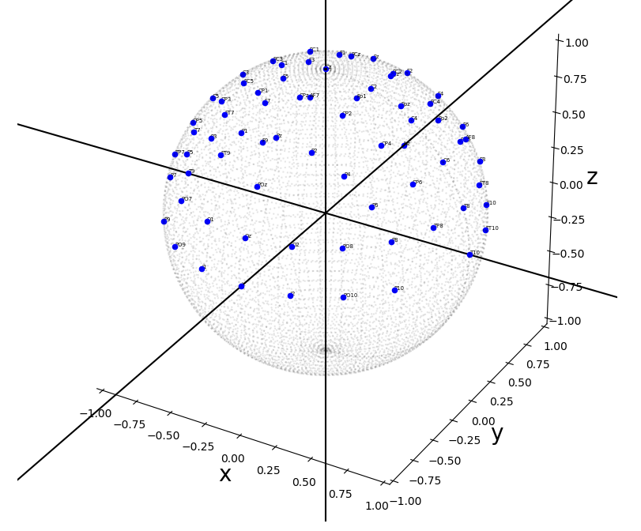
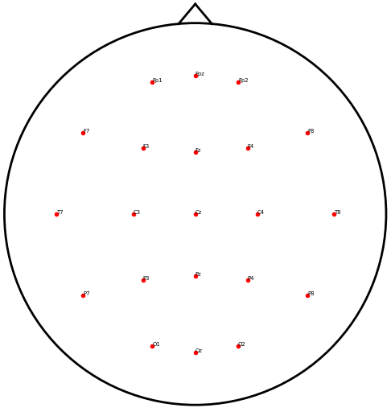
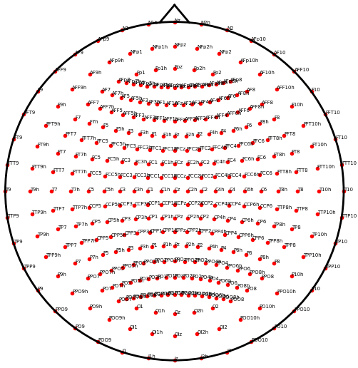

# eeg_positions

When recording electroencephalography (EEG) data, electrodes are usually placed
according to an international standard. The 10-20, and by extension the 10-10
and 10-05 systems are established sets of rules for this case [1]. Even when
the actual electrode positions have not been empirically measured during the
recording, an approximation  of these positions is important for for plotting
topographies or visualizing locations of sensors with the help of analysis
software.

While standard positions are available in many places such as from Robert
Oostenveld's [blog](http://robertoostenveld.nl/electrode/) or directly from
electrode cap manufacturers such as Easycap; with this repository I tried very
hard to provide an explicit and obvious documentation on how to obtain these
coordinates.

This repository contains all you need to compute the standard EEG electrode
positions in 3D for the 10-20, 10-10, or even 10-05 system.

#### At a glance

- The coordinates are computed on a geometrical sphere centered on the origin and
  with radius 1.
- At its core, the function uses an algorithm to compute positions at fractions
  along contour lines defined by three points.
- The electrode positions can be plotted in 3D or in 2D using a stereographic
  projection.

#### How to work with it

- `git clone` the repository (or download as .zip and unpack)
- `cd eeg_positions`
- Using your python environment of choice, install the package locally using
  `pip install -e .`
- Run the tests using `pytest`
- Calculate and plot electrodes by calling `python eeg_positions.py` in the
  `eeg_positions/eeg_positions` directory
- Check out `contour_labels.py` for the order how electrodes are computed
- ... and see `utilities.py` for the `find_point_at_fraction` function that is
  the core of the computations.

#### References
[1] [Oostenveld, R., & Praamstra, P. (2001). The five percent electrode system for high-resolution EEG and ERP measurements. Clinical neurophysiology, 112(4), 713-719.](https://www.biosemi.com/publications/pdf/Oostenveld2001b.pdf)

-------------------------------------------------------------------------------
# EEG Electrode Position Data

You can also just download the precomputed electrode positions in tab-separated
data format.

 - [standard_1020](../data/standard_1020.tsv)
 - [standard_1010](../data/standard_1010.tsv)
 - [standard_1005](../data/standard_1005.tsv)

# Examples

## Interactively viewing 3D coordinates

## Projections to 2D
### 10-20 system

### 10-10 system

### 10-05 system

-------------------------------------------------------------------------------
# Details

## Coordinate System Conventions

### 3D Axes and Cartesian Coordinate System
- Imagine the x-axis pointing roughly towards the viewer with increasing values
- The y-axis is orthogonal to the x-axis, pointing to the right of the viewer with increasing values
- The z-axis is orthogonal to the xy-plane and pointing vertically up with increasing values

### Relationship of Coordinate System to a Human Head

For simplicity, we assume a spherical head shape of a human. Roughly speaking, the x-axis goes from the left ear through the right ear, the y-axis goes orthogonally to that from the inion through the nasion, and the z-axis goes orthogonally to that plane through the vertex of the scalp.

We use the following anatomical landmarks to define the boundaries of the sphere:

##### Cartesian Coordinates
- The left preauricular point = (-1, 0, 0) ... coincides with T9
- The right preauricular point = (1, 0, 0) ... coincides with T10
- The nasion = (0, 1, 0) ... coincides with Nz
- The inion = (0, -1, 0) ... coincides with Iz
- The vertex = (0, 0, 1) ... coincides with Cz
